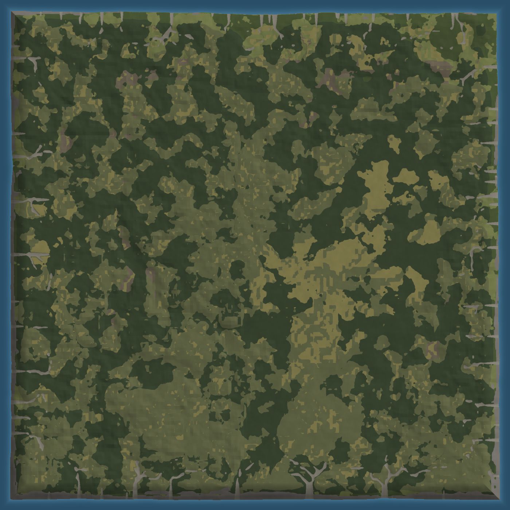
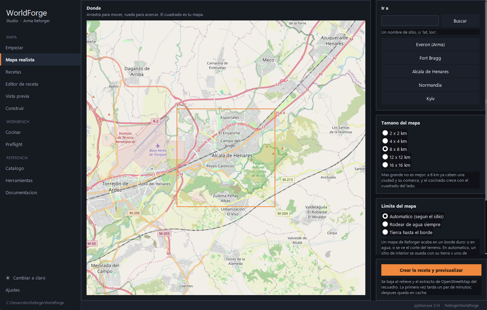

# WorldForge Standard — Arma Reforger map generator

> Standard edition: unlimited **procedural** maps. Support adds real-site tracing from a map (see below).

## ▶ Your first map in 3 minutes

[](https://streamable.com/jfb5mr)

### **[▶ Watch: how to create the first test map](https://streamable.com/jfb5mr)**

From recipe to addon, step by step.

## What it is

Give it a JSON recipe (or click through the UI) and it writes an addon that Workbench opens: baked terrain, hydrology, properly-profiled roads, forests, towns with streets, missions and `.gproj`.

It doesn't copy anyone's `.terr`: it writes the whole thing from scratch with its own non-colliding GUIDs.


*8 km temperate island from `recipes/everon_like.json`.*

## Standard vs Support — with screenshots

### Standard: procedural + your image (included here)

- **5 ways in Start:** Random map · From template (13) · Custom procedural · From your image · (the 2 real-site ones are Support, shown with a badge).
- **13 templates in `recipes/`:** `everon_like`, `arland_like`, `archipelago`, `valle_montana`, `alta_montana`, `arid_plateau`, `costa_urbana`, `interior_agricola`, `bosque_cerrado`, `peninsula`, `isla_grande`, `montane_valley`, `texas_like`.
- **Image mode:** your PNG/JPG drives coast + forest; add a grayscale heightmap and it drives elevation too.
- **Full pipeline:** Preview, Build, Cook (Workbench via CLI: shore map, rivers, generators, `.topo`, triple navmesh, BSP), Preflight, Catalog, Tools, Docs.
- **Biomes:** `everon`, `arland`, `montane`, `arid`, `texas`. Seed fixes everything (same JSON = same map byte-for-byte).

Real program shots (dark theme, Spanish UI):

- `assets/images/standard-empezar.png` — Start (2 Support paths badged)
- `assets/images/standard-recetas.png` — Recipes (templates + JSON detail)
- `assets/images/standard-editor.png` — Recipe editor (Verdania loaded)
- `assets/images/standard-preview.png` — Preview
- `assets/images/standard-build.png` — Build
- `assets/images/standard-realista-bloqueado.png` — what Standard shows on Realistic map (Support card)

### Support: realistic map (pick the area on the map)


*Realistic-map screen captured from the app: drag, wheel-zoom, orange square = your 2×2–16×16 km map → “Create recipe and preview”. Search + shortcuts.*

- **Real sources:** Copernicus DEM elevation, ESA WorldCover, OpenStreetMap roads + waterways + landuse + building footprints (~10,000 houses over a city at 8 km, real footprint + rotation). Sentinel-2 color.
- **Sizes:** 2×2, 4×4, 8×8 (recommended), 12×12, 16×16 km. 8 km already fits city + region; cooking scales with side².
- **Edge:** Automatic (inland=land, coast=water), Water ring, Land to edge (cut visible — normal in Reforger).
- **On Standard** this screen shows a “Real-site tracing is Support” card pointing to templates/procedural.

| | Standard | Support |
|---|---|---|
| Procedural (13 templates, biomes, relief, towns) | ✅ | ✅ |
| Image mode (your satellite → coast & forest) | ✅ | ✅ |
| Preview, build, cook, preflight, catalog | ✅ | ✅ |
| Copernicus DEM elevation | — | ✅ |
| ESA WorldCover | — | ✅ |
| OSM roads, rivers & houses | — | ✅ |
| Arma 3 `.wrp` import | — | ✅ |

## Download

From **Releases**: full `WorldForge-Standard` folder (`WorldForge.exe` 49 MB + `WorldForgeTools/` + `recipes/` + `locales/` + `docs/`). Don't download the lone `.exe`.

Requirements: Windows 10/11 64-bit, Arma Reforger Tools.

## Video guide

Full `test` map generation (Verdania, 8 km): from recipe to Workbench-ready addon.

[▶ Watch: how to create the first test map](https://streamable.com/jfb5mr)

## Use

```powershell
WorldForge.exe                         # UI
WorldForge.exe --cli preview recipes/everon_like.json --out preview.png
WorldForge.exe --cli build recipes/everon_like.json --out C:/Desarrollo/MiMapa
WorldForge.exe --cli check C:/Desarrollo/MiMapa
WorldForge.exe --cli cook C:/Desarrollo/MiMapa
```

Order: Build → Cook → Preflight → open in Workbench:

```powershell
& "C:/Program Files (x86)/Steam/steamapps/common/Arma Reforger Tools/Workbench/ArmaReforgerWorkbenchSteamDiag.exe" `
  -gproj "C:/Desarrollo/MiMapa/addon.gproj" `
  -addonsDir "C:/Program Files (x86)/Steam/steamapps/common/Arma Reforger/addons,C:/Desarrollo" `
  -wbmodule=WorldEditor -run -load "worlds/MiMundo/MiMundo.ent"
```

Minimal recipe:

```json
{
  "name": "Verdania", "seed": 1979,
  "size_m": 8192, "cell_size": 2.0,
  "landform": "island", "relief": "rolling",
  "biome": "everon", "forest_cover": 0.34,
  "settlement_density": 1.0, "game_modes": ["GM"]
}
```

`--set` overrides without editing: `--set seed=42 --set relief=mountainous`.

## Docs

- `docs/TEMPLATES.md` — 13 templates + field table.
- `docs/PIPELINE_EN.md` — build/cook phases and why in that order.
- `recipes/` — copy/paste, change `name` + `seed`.

## Language

Spanish by default, English included. Auto from Windows, switch in Settings (restarts).

## Support

Standard + real-site + `.wrp`. Needs `worldforge.lic` next to the `.exe`. To request it open a “Support” Issue.

## License

See [LICENSE](../LICENSE). Free to use to generate maps. No generator source in this repo.
