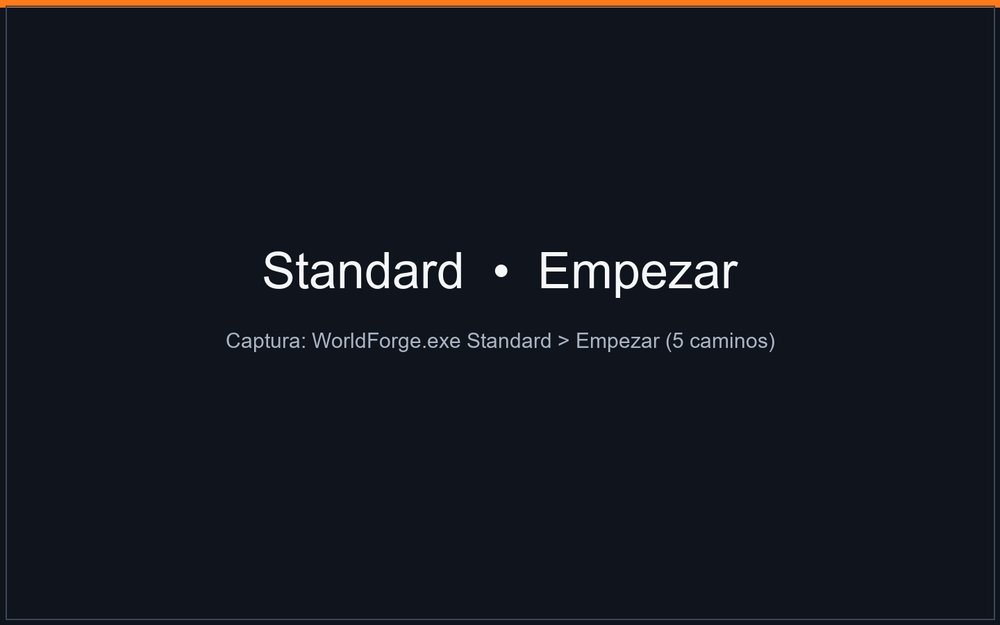
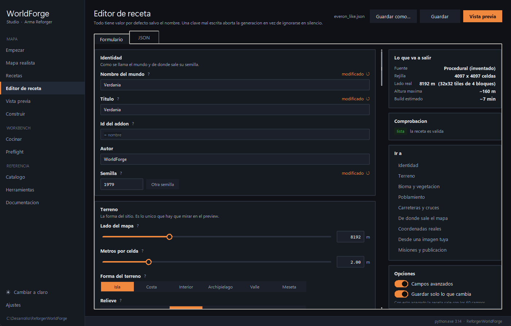

# WorldForge — generador de mundos para Arma Reforger

> Mapas procedurales **sin límites** y calcado de sitios reales del planeta. Gratis y completo.

## ▶ Tu primer mapa en 3 minutos

[](https://streamable.com/jfb5mr)

### **[▶ Ver video: cómo crear el primer mapa test](https://streamable.com/jfb5mr)**

De la receta al addon, paso a paso.

## Qué es

Le das una receta JSON (o la haces clicando en la interfaz) y te escribe un addon que el Workbench abre: terreno cocido, hidrología, carreteras con perfil real, bosques, pueblos con calles, misiones y `.gproj`.

No copia el `.terr` de nadie: lo escribe entero desde cero con GUIDs propios que no chocan.


*Isla templada 8 km desde `recipes/everon_like.json`.*

## Todo incluido

**Gratis y completo.** No hay versión recortada ni funciones bloqueadas: todo
lo que hay aquí funciona.

| | |
|---|---|
| Procedural ilimitado + 13 plantillas | ✅ |
| Modo imagen (tu satelital → costa y arbolado) | ✅ |
| Preview, Construir, Cocinar, Preflight, Catálogo | ✅ |
| **Mapa realista: eliges la zona y se calca** | ✅ |
| Relieve Copernicus DEM | ✅ |
| Suelo ESA WorldCover | ✅ |
| Carreteras, cauces y casas de OSM | ✅ |
| Import Arma 3 `.wrp` | ✅ |

### Procedural



Empezar: aleatorio, plantilla, procedural a medida, desde tu imagen. Biomas:
`everon`, `arland`, `montane`, `arid`, `texas`.


*Editor de receta: cada campo con su ayuda, comprobación en vivo y resumen de
lo que va a salir.*

### Mapa realista


Arrastra, zoom con la rueda, el cuadrado naranja es tu mapa (2×2 – 16×16 km) →
*Crear la receta y previsualizar*. Calca el relieve del Copernicus DEM, la
cobertura del suelo de ESA WorldCover y, de OpenStreetMap, las carreteras, los
cauces y las huellas de los edificios: **unas 10.000 casas en 8 km sobre una
ciudad, con su planta y su giro reales**.

## Descarga

En **Releases**: carpeta `WorldForge` completa (`WorldForge.exe` 82 MB + `WorldForgeTools/` + `recipes/` + `locales/` + `docs/`). No descargues solo el `.exe`.

Requisitos: Windows 10/11 64-bit, Arma Reforger Tools.

## Primer arranque

### No hace falta Python

El `.exe` lleva dentro su propio Python, numpy, scipy y Tk. Descomprimir y
doble clic: no hay nada que instalar.

Lo que **sí** hace falta:

| | Para qué | ¿Obligatorio? |
|---|---|---|
| **Arma Reforger** | Abrir el mapa que has hecho | Sí, para jugarlo |
| **Arma Reforger Tools** | Cocinar (navmesh, mapa del jugador, generadores) | Sí, para terminar un mapa |
| Python | — | **No** |

> **Las Tools son una entrada aparte en Steam**, no vienen con el juego.
> Búscalas como *Arma Reforger Tools*. Sin ellas se genera el addon entero y
> el terreno, pero no se puede cocinar, y un mapa sin cocinar abre sin
> navegación de IA y con el mapa del jugador vacío.

### Descomprime la carpeta entera

El `.exe` suelto no funciona: necesita `WorldForgeTools/` (el plugin que
hornea los generadores) y `recipes/` al lado. Déjala donde puedas escribir,
**no** en `C:\Program Files`.

### Ajustes: las cuatro rutas

Este es el paso que la gente se salta, y luego no cocina nada.

- **Proyecto WorldForge** — la carpeta de arriba. La encuentra sola.
- **Carpeta de addons generados** — donde se escriben tus mapas. Ponla al lado
  de la de WorldForge: así el `-addonsDir` del Workbench los ve sin tocar nada.
- **Ejecutable del Workbench** — pulsa **Detectar Steam**. Si no, la ruta suele
  ser `C:\Program Files (x86)\Steam\steamapps\common\Arma Reforger Tools\Workbench\ArmaReforgerWorkbenchSteamDiag.exe`.
  **Si Steam está en otra unidad la ruta de fábrica no vale**, y es con
  diferencia la causa nº 1 de que el cocinado falle.
- **Addons del juego base** — normalmente
  `C:\Program Files (x86)\Steam\steamapps\common\Arma Reforger\addons`.
  Sin ella el Workbench muere con `Game addon '58D0FB3206B6F859' not found`.

Pulsa **Guardar rutas**: los puntos de *Estado del entorno* se ponen en verde.
Las dos últimas valen también como variables de entorno `AR_WB_EXE` y
`AR_GAME_ADDONS`.

### Comprueba que está todo bien

**Empezar → Mapa aleatorio → Generar y construir**, y después **Cocinar**. El
Workbench se abre y se cierra solo, una vez por paso. Marca *Saltar el
navmesh* si solo quieres mirarlo, y *Abrir el mundo al terminar* para que el
World Editor se abra con él. Si eso funciona de punta a punta, está todo bien.

## Video guía

Generación completa del mapa `test` (Verdania, 8 km): de la receta al addon listo.

[▶ Ver video: cómo crear el primer mapa test](https://streamable.com/jfb5mr)

## Uso

```powershell
WorldForge.exe                         # interfaz
WorldForge.exe --cli preview recipes/everon_like.json --out preview.png
WorldForge.exe --cli build recipes/everon_like.json --out C:/Desarrollo/MiMapa
WorldForge.exe --cli check C:/Desarrollo/MiMapa
WorldForge.exe --cli cook C:/Desarrollo/MiMapa
```

Orden: Construir → Cocinar → Preflight → abrir en Workbench:

```powershell
& "C:/Program Files (x86)/Steam/steamapps/common/Arma Reforger Tools/Workbench/ArmaReforgerWorkbenchSteamDiag.exe" `
  -gproj "C:/Desarrollo/MiMapa/addon.gproj" `
  -addonsDir "C:/Program Files (x86)/Steam/steamapps/common/Arma Reforger/addons,C:/Desarrollo" `
  -wbmodule=WorldEditor -run -load "worlds/MiMundo/MiMundo.ent"
```

Receta mínima:

```json
{
  "name": "Verdania", "seed": 1979,
  "size_m": 8192, "cell_size": 2.0,
  "landform": "island", "relief": "rolling",
  "biome": "everon", "forest_cover": 0.34,
  "settlement_density": 1.0, "game_modes": ["GM"]
}
```

`--set` sobrescribe sin tocar el fichero: `--set seed=42 --set relief=mountainous`.

## Portar un mapa de Arma 3

Si tienes un mundo de Arma 3, WorldForge lo reconstruye en Reforger. Son tres
piezas independientes y puedes usar las que quieras:

| En la receta | Qué trae del original |
|---|---|
| `heightmap.wrp` | **El relieve.** Se lee del `.wrp` tal cual. Si el mapa de Arma 3 mide lo mismo que el tuyo es 1:1 y no hay maqueta. |
| `objects_wrp` | **Los viales y los edificios**, en sus posiciones reales. En Jackson County: 2.203 piezas de calzada encadenadas en 88 trazados y 855 edificios. |
| `places_file` | **Los pueblos**, del `class Names` del `.hpp`: nombre, posición, radio y tamaño. En Jackson County, 40 sitios con nombre. |

```json
{
  "name": "JacksonCounty", "size_m": 10240, "cell_size": 2.0,
  "heightmap":   { "wrp": "C:/.../Jackson_County.wrp" },
  "objects_wrp":        "C:/.../Jackson_County.wrp",
  "places_file":        "C:/.../Jackson_County.hpp"
}
```

Lo que **no** viene del original se sigue generando: bosques, vallas, tendido
eléctrico y el resto. Y si el mapa original tiene zonas incomunicadas, con
`road_links` le añades las carreteras que le faltan (abajo).

> El radio que trae un `.hpp` describe la **etiqueta** del sitio en el mapa,
> no su casco urbano, y suele quedar generoso: salen pueblos de 500 m donde
> hay una aldea. `settlement_radius_scale` a 0.6–0.8 lo deja en su sitio.

## Escala vertical: la trampa de los mapas reales

**Esto arruina mapas y no da ningún error.** Si el recuadro real que marcas
mide 245 km y tu mapa mide 12,8, lo horizontal se encoge 19 veces. Si la
altura no se encoge igual, **todas las pendientes salen multiplicadas por
19**: el mapa es precioso en el editor y no se puede conducir.

Lo arregla `heightmap.height_scale`. No hace falta calcularlo a mano: en
*Mapa realista* pulsa **Calcular la escala recomendada** y lo pone. Entre 3 y
4 veces de exageración es lo que deja un mapa comprimido que se lee bien y se
conduce; 1.0 es la altura real y solo vale si el recuadro mide lo mismo que
tu mapa.

## Más cosas que sabe hacer

**Atlas multi-región.** Un mapa puede componerse de varios recuadros reales
colocados en sitios concretos, cada uno con su propia escala vertical. Es
como está hecha la receta de España (península, Baleares y Canarias en un
solo mapa de 12,8 km) y la de México.

**Trazados exactos.** `road_paths` tiende una carretera tal cual, sin trazador
ni A\*. Es lo que necesita un circuito: para el Nürburgring la geometría **es**
el producto y no la puede elegir un algoritmo.

**Enlaces de carretera.** `road_links` añade las carreteras que el mapa no
tiene y hacen falta para recorrerlo. Cada entrada es un recorrido: nombres de
sitios o pares `x, z`. En un archipiélago, `road_links_water` con un coste
caro (150 va bien) hace que el trazador cruce por el estrecho más angosto en
vez de dejar cada isla con su red suelta.

**Pueblos de verdad.** Las casas se orientan a la calle, llevan valla de
parcela (el 61% en Everon, medido) y trastos en el patio; los puertos salen
junto a los núcleos costeros y el tendido eléctrico sigue los viales.

## Documentación

- `docs/PLANTILLAS.md` — las 13 plantillas + tabla de campos.
- `docs/PIPELINE.md` — fases build/cook y por qué en ese orden.
- `recipes/` — copia/pega y cambia `name` + `seed`.

## Idioma

Castellano por defecto, inglés incluido. Auto desde Windows, en Ajustes se cambia (relanza).

## Apoyar el proyecto

WorldForge es **gratis y completo**: todo lo de arriba funciona y no se guarda
nada.

Si te ahorra tiempo y quieres que siga adelante, **las versiones nuevas y
mejoradas van antes a quien lo apoya**:

- ☕ **Ko-fi:** <https://ko-fi.com/arribas>
- 💬 **Discord:** `alv4r0` — escríbeme después de donar y te paso las versiones
  nuevas.

Sin claves, sin activación y sin dar la lata.

## Licencia

Ver [LICENSE](../LICENSE). Uso gratuito para generar mapas. Sin fuentes del generador en este repo.
