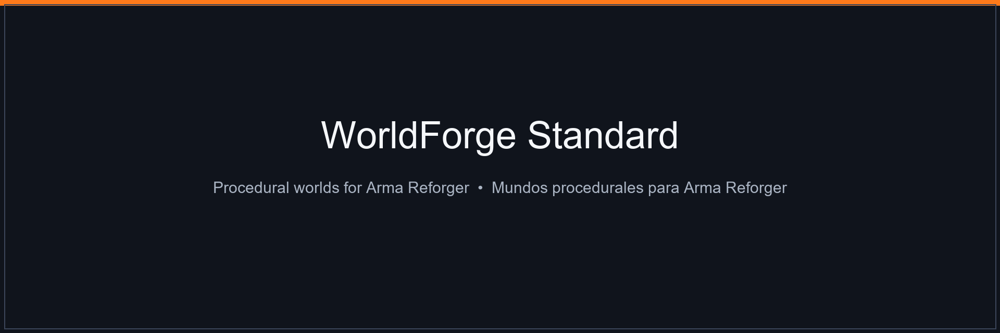

[](https://github.com/) [](https://reforger.armaplatform.com/) [](README.es.md) [](README.en.md) [](LICENSE)

# WorldForge Standard

> **Genera mundos completos y jugables para Arma Reforger. Procedural ilimitado, gratis.**
> **Generate complete, playable Arma Reforger worlds. Unlimited procedural, free.**

Docs completas: **[Español](README.es.md)** · **[English](README.en.md)**

De una receta JSON a un addon que abre Workbench: terreno cocido, carreteras con perfil real, bosques, pueblos con calles, misiones y `.gproj`. Sin copiar `.terr` de nadie: lo escribe entero con GUIDs propios.

From a JSON recipe to a Workbench-ready addon: baked terrain, properly-profiled roads, forests, towns with streets, missions and `.gproj`. No copied `.terr`: fully written with its own GUIDs.

**[⬇ Descargar en Releases](../../releases)** · **[🚀 Quickstart](#-3-pasos--3-steps)** · **[Standard vs Premium](#-standard-vs-premium)** · **[Recetas](#-recetas--templates)**

---

## Por qué probarlo / Why try it

- **Mapa jugable en minutos:** aleatorio o plantilla → preview en 30-60 s → build → cook → jugar.
- **Playable map in minutes:** random or template → 30-60 s preview → build → cook → play.
- **No parece ruido:** erosión hidráulica, carreteras A\* con Chaikin, pueblos desde las calles, drenaje difuminado.
- **Doesn't look like noise:** hydraulic erosion, A\* roads with Chaikin, street-first towns, blurred drainage.
- **Repetible:** `seed` fija todo. Mismo JSON = mismo mapa byte a byte.
- **Reproducible:** `seed` fixes everything. Same JSON = same map byte-for-byte.


*Isla templada 8 km desde `recipes/everon_like.json` / 8 km temperate island from `recipes/everon_like.json`.*

---

## 🔃 Standard vs Premium

| | Standard (este repo / this repo) | Premium |
|---|---|---|
| Procedural ilimitado + 13 plantillas / Unlimited procedural + 13 templates | ✅ | ✅ |
| Modo imagen (tu satelital → costa y arbolado) / Image mode | ✅ | ✅ |
| Preview, Build, Cook, Preflight, Catálogo / Catalog | ✅ | ✅ |
| **Mapa realista: eliges la zona y se calca / Real-site: pick area, it gets traced** | ❌ | ✅ |
| Relieve Copernicus DEM / Elevation | — | ✅ |
| Suelo ESA WorldCover / Ground cover | — | ✅ |
| Carreteras, cauces y casas OSM / OSM roads, rivers, houses | — | ✅ |
| Import Arma 3 `.wrp` | — | ✅ |

### Standard — lo que haces aquí


- Empezar: aleatorio, plantilla, procedural a medida, desde tu imagen.
- Start: random, template, custom procedural, from your image.
- Flujo / Flow: Preview → Construir/Build → Cocinar/Cook → Preflight.
- Biomas / Biomes: `everon`, `arland`, `montane`, `arid`, `texas`.


*Editor de receta con Verdania cargada: cada campo con ayuda, comprobación en vivo y resumen de lo que va a salir.*
*Recipe editor with Verdania loaded: every field with help, live validation and build summary.*

### Premium — calca un sitio real


*Mapa realista: arrastra, zoom con rueda, cuadrado naranja = tu mapa 2×2–16×16 km → “Crear la receta y previsualizar”. Buscador + Everon, Fort Bragg, Alcalá de Henares, Normandía, Kyiv.*
*Realistic map: drag, wheel-zoom, orange square = your 2×2–16×16 km map → “Create recipe and preview”. Search + shortcuts.*

Calca / Traces: Copernicus DEM + ESA WorldCover + OSM (carreteras, cauces, usos, **~10.000 casas en 8 km con planta y giro reales**). En Standard esta pantalla muestra cartel Premium y te manda a plantillas.

---

## 🚀 3 pasos / 3 steps

```powershell
WorldForge.exe   # interfaz / UI
```

```powershell
# 1. Mira antes (no escribe nada) / Look first
WorldForge.exe --cli preview recipes/everon_like.json --out preview.png
# 2. Genera / Build
WorldForge.exe --cli build recipes/everon_like.json --out C:/Desarrollo/MiMapa
# 3. Revisa + cocina / Check + cook
WorldForge.exe --cli check C:/Desarrollo/MiMapa
WorldForge.exe --cli cook C:/Desarrollo/MiMapa
```

Abrir en Workbench / Open in Workbench:

```powershell
& "C:/Program Files (x86)/Steam/steamapps/common/Arma Reforger Tools/Workbench/ArmaReforgerWorkbenchSteamDiag.exe" `
  -gproj "C:/Desarrollo/MiMapa/addon.gproj" `
  -addonsDir "C:/Program Files (x86)/Steam/steamapps/common/Arma Reforger/addons,C:/Desarrollo" `
  -wbmodule=WorldEditor -run -load "worlds/MiMundo/MiMundo.ent"
```

## 🗺 Recetas / Templates

`recipes/` — copia, cambia `name` + `seed`, genera. / copy, change `name` + `seed`, build.

| Receta | Ideal para / Best for |
|---|---|
| `everon_like` | Isla templada default / Default temperate island |
| `arland_like` | Isla atlántica pequeña / Small atlantic island |
| `archipelago` | Islas (sin puentes) / Islands (no bridges) |
| `valle_montana`, `montane_valley` | Valle encajado / Carved valley |
| `alta_montana` | Alta montaña (roca, no nieve) / High mountain |
| `arid_plateau`, `texas_like` | Desierto / meseta / Arid / plateau |
| `costa_urbana` | Ciudad + comarca / City + region |
| `interior_agricola` | Campos y caseríos / Fields and hamlets |
| `bosque_cerrado` | Emboscadas / Ambush forest |
| `peninsula`, `isla_grande` | Costa larga / Long coast |

Detalle de campos: [docs/PLANTILLAS.md](docs/PLANTILLAS.md) · Pipeline: [docs/PIPELINE.md](docs/PIPELINE.md).

## ⬇ Descarga / Download

En **[Releases](../../releases)**: carpeta completa `WorldForge-Standard` (`WorldForge.exe` + `WorldForgeTools/` + `recipes/` + `locales/` + `docs/`). El `.exe` suelto no basta.

From **[Releases](../../releases)**: full folder. Lone `.exe` is not enough.

Requisitos / Requirements: Windows 10/11 64-bit · Arma Reforger Tools + juego / game.

## ❓ FAQ

**¿Standard es demo? / Is Standard a demo?**
No. Mapas completos y jugables. Premium solo añade sitio real + `.wrp`. / No. Full playable maps. Premium only adds real-site + `.wrp`.

**¿Nieve? / Snow?**
Reforger 1.8 no trae superficie de nieve. Alta montaña = roca. / No snow surface in 1.8. High mountain = rock.

**¿Puentes? / Bridges?**
No. El agua es infranqueable para el trazado (a propósito). / No. Water is untraversable by design.

**¿Idioma? / Language?**
ES por defecto + EN. Auto desde Windows, en Ajustes (relanza). / ES default + EN. Auto from Windows, in Settings (restarts).

## 💎 Premium

Standard + sitio real + `.wrp`. Pide `worldforge.lic` junto al `.exe`. ¿Lo quieres? Abre un Issue “Premium”.
Standard + real-site + `.wrp`. Needs `worldforge.lic` next to `.exe`. Want it? Open a “Premium” Issue.

## 📁 Repo

```
recipes/  docs/  assets/images/
```

Binarios por Release, nunca por commit. / Binaries via Releases, never committed.

## 📄 Licencia / License

[MIT](LICENSE) — docs, recetas y capturas libres para generar mapas (incluso comerciales). Mapas generados = tuyos (aplica EULA de Reforger).
Docs, recipes and shots free to generate maps (even commercial). Generated maps = yours (Reforger EULA applies).
