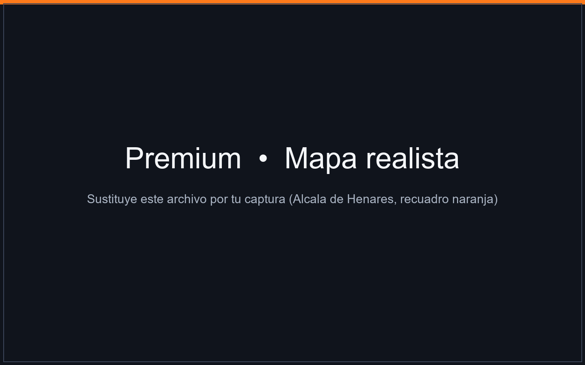

# WorldForge Standard — Generador de mapas para Arma Reforger / Map generator for Arma Reforger

> 🇪🇸 Español abajo · 🇺🇸 English below · Documentación completa: [🇪🇸 README.es.md](README.es.md) · [🇺🇸 README.en.md](README.en.md)

**WorldForge Standard** genera mundos completos y jugables para Arma Reforger: terreno, carreteras, bosques, pueblos con calles, misiones y `.gproj` listo para abrir en Workbench. **Procedural ilimitado, gratis.**

**WorldForge Standard** generates complete, playable worlds for Arma Reforger: terrain, roads, forests, towns with streets, missions and a `.gproj` ready to open in Workbench. **Unlimited procedural, free.**

| | Standard | Premium |
|---|---|---|
| Procedural ilimitado (13 plantillas, biomas, relieve, pueblos) / Unlimited procedural (13 templates, biomes, relief, towns) | ✅ | ✅ |
| Modo imagen (tu satelital → costa y arbolado) / Image mode (your satellite → coast & forest) | ✅ | ✅ |
| Preview, build, cocinado/cook, preflight, catálogo/catalog | ✅ | ✅ |
| **Mapa realista: eliges la zona en el mapa y se calca** / **Real-site mode: pick an area on the map and it gets traced** | ❌ | ✅ |
| Relieve real Copernicus DEM / Real elevation (Copernicus DEM) | ❌ | ✅ |
| Suelo ESA WorldCover / Ground cover (ESA WorldCover) | ❌ | ✅ |
| Carreteras, cauces y casas de OpenStreetMap / Roads, rivers & houses from OpenStreetMap | ❌ | ✅ |
| Import de mundos Arma 3 (`.wrp`) / Arma 3 world import (`.wrp`) | ❌ | ✅ |

👉 Detalle con capturas / Details with screenshots: [🇪🇸 Español](#-standard-vs-premium-es) · [🇺🇸 English](#-standard-vs-premium-en)

---

## 📸 Standard vs Premium (ES)

### Standard — Procedural sin límites


*Ejemplo procedural: isla templada 8 km generada desde `recipes/everon_like.json`.*

- **Empezar → Mapa aleatorio / Desde una plantilla / Procedural a medida / Desde una imagen tuya.** Nada que descargar, semilla = mismo mapa siempre.
- **13 plantillas listas:** `everon_like`, `arland_like`, `archipelago`, `valle_montana`, `alta_montana`, `arid_plateau`, `costa_urbana`, `interior_agricola`, `bosque_cerrado`, `peninsula`, `isla_grande`, `montane_valley`, `texas_like`.
- **Modo imagen (Standard sí):** le das tu PNG/JPG y la costa + arbolado salen de la foto. Si añades relieve en grises, también la cota.
- **Flujo:** `Preview` (mira antes) → `Construir` (escribe el addon + terreno cocido `.ttile`) → `Cocinar` (Workbench: shore map, ríos, generadores, `.topo`, navmesh) → `Preflight` (revisa GUIDs, capas, carreteras).
- **Lo que sale:** mundo + misiones GM/Conflict/Plain, satelital del jugador, minimapa.

> 📷 **Añade tus capturas Standard aquí:**
> - `assets/images/standard-empezar.png` — pantalla *Empezar* (5 caminos)
> - `assets/images/standard-editor.png` — *Editor de receta* procedural
> - `assets/images/standard-preview.png` — *Vista previa* de un mapa procedural

### Premium — Calca un sitio real



*Premium / Mapa realista: mueves el mapa, colocas el cuadrado naranja (tu mapa 2×2 a 16×16 km) y pulsas “Crear la receta y previsualizar”. Buscador + atajos: Everon, Fort Bragg, Alcalá de Henares, Normandía, Kyiv.*

*(Si ves este texto sin imagen, guarda tu captura como `assets/images/premium-mapa-realista.png` — es la imagen que adjuntaste en el chat).*

- **Dónde:** pantalla *Mapa realista*. Arrastrar = mover, rueda = zoom. El cuadrado naranja es tu mapa a escala real.
- **Qué calca:** relieve Copernicus DEM + cobertura ESA WorldCover + de OpenStreetMap: carreteras, cauces, usos del suelo y **huellas de edificios (~10.000 casas en 8 km de ciudad, con planta y giro reales).**
- **Tamaño:** 2×2, 4×4, 8×8 (recomendado: cabe ciudad + comarca), 12×12, 16×16 km.
- **Límite del mapa:** Automático (según sitio) / Rodear de agua siempre / Tierra hasta el borde.
- Fondo = teselas OSM (lo que ves es lo que se calca). Primera descarga tarda un par de minutos, luego queda en caché.

| Función / pantalla | Standard | Premium (esta captura) |
|---|---|---|
| Empezar, Recetas, Editor, Vista previa, Construir, Cocinar, Preflight, Catálogo | ✅ | ✅ |
| Mapa realista (buscador, atajos, recuadro, tamaño, límite) | 🔒 muestra cartel “Premium” + te manda a plantillas | ✅ |
| Desde coordenadas reales (Copernicus + OSM) | 🔒 | ✅ |
| Import Arma 3 `.wrp` | — | ✅ |

---

## 📸 Standard vs Premium (EN)

### Standard — Unlimited procedural


*Procedural example: 8 km temperate island built from `recipes/everon_like.json`.*

- **Start → Random map / From a template / Custom procedural / From your image.** Nothing to download, seed = same map every time.
- **13 ready templates:** `everon_like`, `arland_like`, `archipelago`, `valle_montana`, `alta_montana`, `arid_plateau`, `costa_urbana`, `interior_agricola`, `bosque_cerrado`, `peninsula`, `isla_grande`, `montane_valley`, `texas_like`.
- **Image mode (Standard included):** give it your PNG/JPG and coast + forest come from the photo. Add a grayscale heightmap and elevation comes too.
- **Flow:** `Preview` (look first) → `Build` (writes addon + baked `.ttile` terrain) → `Cook` (Workbench: shore map, rivers, generators, `.topo`, navmesh) → `Preflight` (checks GUIDs, layers, roads).
- **Output:** world + GM/Conflict/Plain missions, player-map satellite, minimap.

> 📷 **Drop your Standard screenshots here:**
> - `assets/images/standard-empezar.png` — *Start* screen (5 ways)
> - `assets/images/standard-editor.png` — procedural *Recipe editor*
> - `assets/images/standard-preview.png` — procedural *Preview*

### Premium — Trace a real place


*Premium / Realistic map: drag the map, place the orange square (your 2×2 to 16×16 km map) and hit “Create recipe and preview”. Search + shortcuts: Everon, Fort Bragg, Alcalá de Henares, Normandy, Kyiv.*

*(If you see broken-image text, save your screenshot as `assets/images/premium-mapa-realista.png` — it's the image you posted in chat).*

- **Where:** *Realistic map* screen. Drag = pan, wheel = zoom. The orange square is your map at true scale.
- **What it traces:** Copernicus DEM elevation + ESA WorldCover + from OpenStreetMap: roads, waterways, landuse and **building footprints (~10,000 houses over a city at 8 km, real footprint + rotation).**
- **Size:** 2×2, 4×4, 8×8 (recommended: city + region fits), 12×12, 16×16 km.
- **Map edge:** Automatic (per site) / Always water ring / Land to the edge.
- Background = OSM tiles (what you see is what gets traced). First download takes a couple minutes, then cached.

| Feature / screen | Standard | Premium (this shot) |
|---|---|---|
| Start, Recipes, Editor, Preview, Build, Cook, Preflight, Catalog | ✅ | ✅ |
| Realistic map (search, shortcuts, box, size, edge) | 🔒 shows “Premium” card → points to templates | ✅ |
| From real coordinates (Copernicus + OSM) | 🔒 | ✅ |
| Arma 3 `.wrp` import | — | ✅ |

---

## ⬇️ Descarga / Download

- **Releases de GitHub (recomendado):** descarga la carpeta `WorldForge-Standard` completa (`WorldForge.exe` + `WorldForgeTools/` + `recipes/` + `locales/`). No basta el `.exe` suelto: sin el addon no cocina y sin recetas no hay plantillas.
- **GitHub Releases (recommended):** download the full `WorldForge-Standard` folder (`WorldForge.exe` + `WorldForgeTools/` + `recipes/` + `locales/`). The lone `.exe` is not enough: no cooking without the addon, no templates without recipes.

Requisitos / Requirements: Windows 10/11 64-bit · Arma Reforger Tools (Workbench) + juego/base game para cocinar y probar / to cook & test.

```powershell
WorldForge.exe                         # abre la interfaz / opens the UI
WorldForge.exe --cli build receta.json --out C:/Desarrollo/MiMapa
```

## 🚀 Uso en 3 pasos / 3-step quickstart

🇪🇸 1. Empezar → *Mapa aleatorio* o *Desde una plantilla* · 2. Vista previa → ajusta `seed` hasta que la costa convenza · 3. Construir → Cocinar → Preflight → abrir en Workbench.
🇺🇸 1. Start → *Random map* or *From a template* · 2. Preview → tweak `seed` until the coast looks right · 3. Build → Cook → Preflight → open in Workbench.

```powershell
# 1. mirar antes (30-60 s, no escribe nada) / look first
WorldForge.exe --cli preview recipes/everon_like.json --out preview.png
# 2. generar / build
WorldForge.exe --cli build recipes/everon_like.json --out C:/Desarrollo/MiMapa
# 3. revisar / check + cocinar / cook
WorldForge.exe --cli check C:/Desarrollo/MiMapa
WorldForge.exe --cli cook C:/Desarrollo/MiMapa
```

Recetas incluidas en `recipes/` (13). Docs: [PLANTILLAS](docs/PLANTILLAS.md) · [PIPELINE](docs/PIPELINE.md).

## 🌍 Idiomas / Languages

🇪🇸 Castellano por defecto, inglés incluido. Se detecta desde Windows, cambiable en Ajustes (relanza el programa).
🇺🇸 Spanish by default, English included. Auto-detected from Windows, switchable in Settings (restarts the app).

## 💎 Premium

🇪🇸 Premium = Standard + calcar sitios reales + `.wrp`. Requiere `worldforge.lic` junto al `.exe`. ¿Tienes Standard y quieres Premium? Abre un *Issue* con el asunto “Premium”.
🇺🇸 Premium = Standard + real-site tracing + `.wrp`. Requires `worldforge.lic` next to the `.exe`. Got Standard and want Premium? Open an *Issue* titled “Premium”.

## 📁 Este repo / This repo

```
WorldForge-Standard/
  README.md / README.es.md / README.en.md
  recipes/            # 13 recetas Standard / Standard recipes
  docs/               # PLANTILLAS, PIPELINE
  assets/images/      # capturas Standard + Premium / screenshots
  WorldForgeTools/    # (en la Release, no aquí) / (in the Release, not here)
```

Binarios por Release, no por commit. `build/` de Nuitka (1,4 GB) nunca se publica.
Binaries via Releases, never committed. Nuitka `build/` (1.4 GB) is never published.

## 📄 Licencia / License

Ver / See [LICENSE](LICENSE). Standard: uso gratuito para generar mapas / free to use to generate maps. El código del generador no se redistribuye aquí / generator source is not redistributed here.
